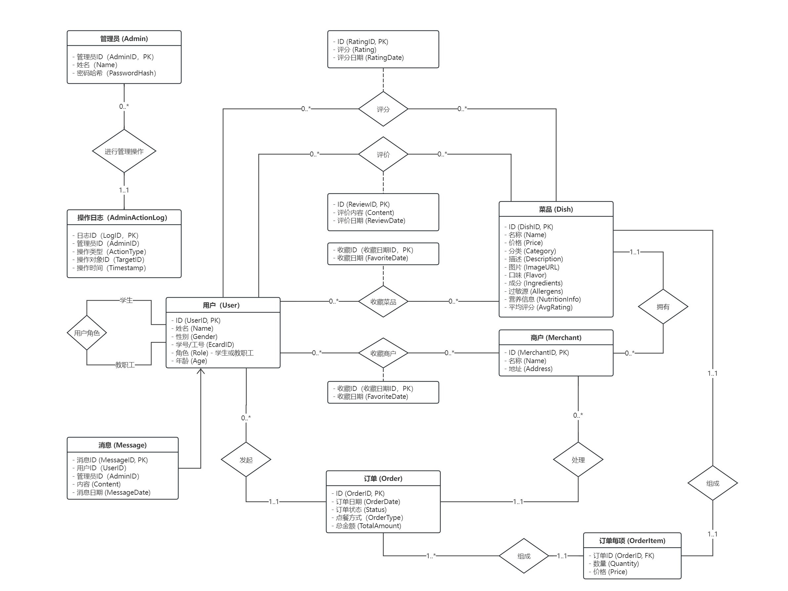

# PJ说明文档
邓景宜 22302010075
吴苏庭 22302010087

**当前的框架是java + web的**

## 1. 运行方法
运行Pj1Application.java，然后在网址栏输入`localhost:8080/`

### 1.1. 用户发出查询
+ 用户索引页：`localhost:8080/user/`
+ 用户查询所有用户列表：`localhost:8080/user/allUserList`
+ 查询第1个用户信息：`localhost:8080/user/id=1`
+ 查询所有商家列表（简略）：`localhost:8080/user/searchMerchant?keyword=`
+ 查询第2个商家列表（简略）：`localhost:8080/user/searchMerchant?keyword=2`
+ 查询第3个商家列表（详细）：`localhost:8080/user/searchMerchantDetails?id=3`
+ 查询第3个商家的关于`p`的菜品：`localhost:8080/user/searchDishes?merchantId=3&keyword=p`

### 1.2. 商家发出查询
+ 用户索引页：`localhost:8080/merchant/`

## 2. ER图设计说明

### 2.1. ER图

### 2.2. 实体关系
1. **用户 (User)/商户 (Merchant)** 和 **订单 (Order)**: 一对多关系，一个用户/商户可以发起/处理多个订单。
2. **订单 (Order)** 和 **订单每项 (OrderItem)**: 一对多关系，一个订单可以包含多个订单项。
3. **菜品 (Dish)** 和 **订单每项 (OrderItem)**: 一对一关系，一个订单项只可以包含一个菜品。
4. **商户 (Merchant)** 和 **菜品 (Dish)**: 一对多关系，一个商户可以有多个菜品。
5. **用户 (User)/菜品 (Dish)** 和 **评价 (Review)**: 多对多关系，一个用户可以对多个菜品进行评价，一个菜品可以有多个评价。
6. **用户 (User)/菜品 (Dish)** 和 **评分 (Rating)**: 多对多关系，一个用户可以对多个菜品进行评分，一个菜品可以有多个评分。
7. **用户 (User)/商户 (Merchant)** 和 **收藏 (Favorite)**: 多对多关系，一个用户可以收藏多个商户，一个商户可以被多个用户收藏。
8. **用户 (User)/菜品 (Dish)** 和 **收藏 (Favorite)**: 多对多关系，一个用户可以收藏多个菜品，一个菜品可以被多个用户收藏。
9. **用户 (User)** 和 **消息 (Message)**: 一对多关系，一个用户可以接收到多个消息，一条消息只能发给一个用户。
10. **管理员 (Admin)** 和 **操作日志 (AdminActionLog)**: 一对多关系，一个管理员可以进行多项操作，一项操作只能由一个管理员执行。

### 2.3. 表设计
1. 用户 (User) 表包含用户的基本信息，用于区分不同的系统用户。
2. 商户 (Merchant) 表包含商户的基本信息，用于存储食堂商户的相关数据。
3. 菜品 (Dish) 表包含商户提供的菜品信息，关联到具体的商户。
4. 订单 (Order) 和 订单项 (OrderItem) 表一起使用，用于存储用户的点餐记录，每个订单包含多个订单项。
5. 消息 (Message) 表用于存储系统管理员发送给用户的各种消息通知。
6. 管理员 (Admin) 表包含管理员的基本信息。
7. 操作日志 (AdminActionLog) 表用于存储系统管理员进行的各类操作，如添加/删除/修改用户/商户等。

##  3. 遇到的问题与解决

### 3.1. Mapper相关
1. 成功添加了数据，但是查询的时候显示某个属性为null：可能是实体类和数据库表中这个属性名称不一致（实体类中需要驼峰，数据库表中小写，字母完全一致）
2. 在运行的类（如MyBatis001.java中）的`List<User> user = sqlSession.selectList("test.findAll");`找不到mybatis.findAll：`<mapper namespace="test">`所以需要改成test.findAll
3. `There was an unexpected error (500) Invalid bound statement: not found`：在controller类使用mapper而不是service来访问函数，并且在mapper里面直接使用@Select而不是写XML
4. `Mapped Statements collection already contains value for`：在mapper里面直接使用@Select而不是写XML

### 3.2. 数据库连接相关
1. 报错：`Failed to determine a suitable driver class`：错误地注释掉了pom.xml里看似重复的projectlombok、mybatis和mysql，补充回来即可。
2. 报错：